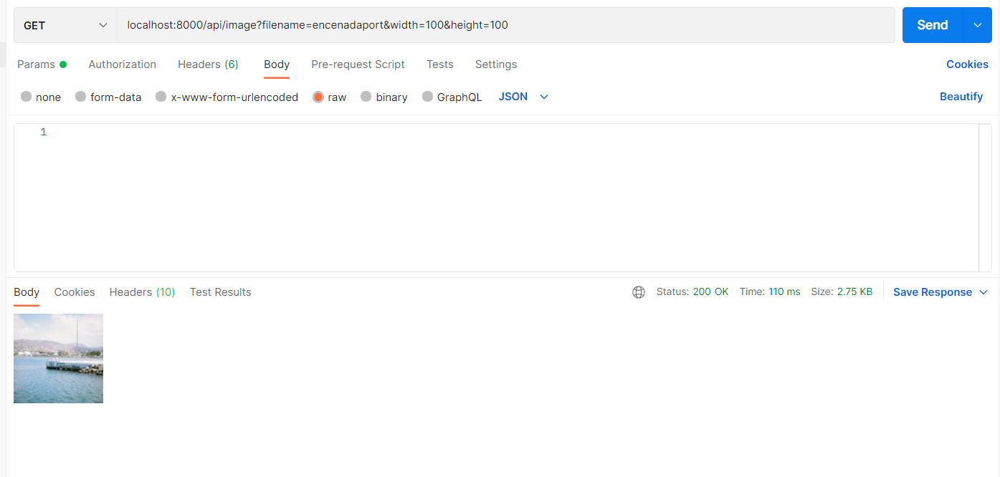
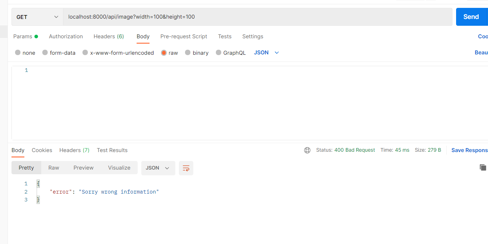
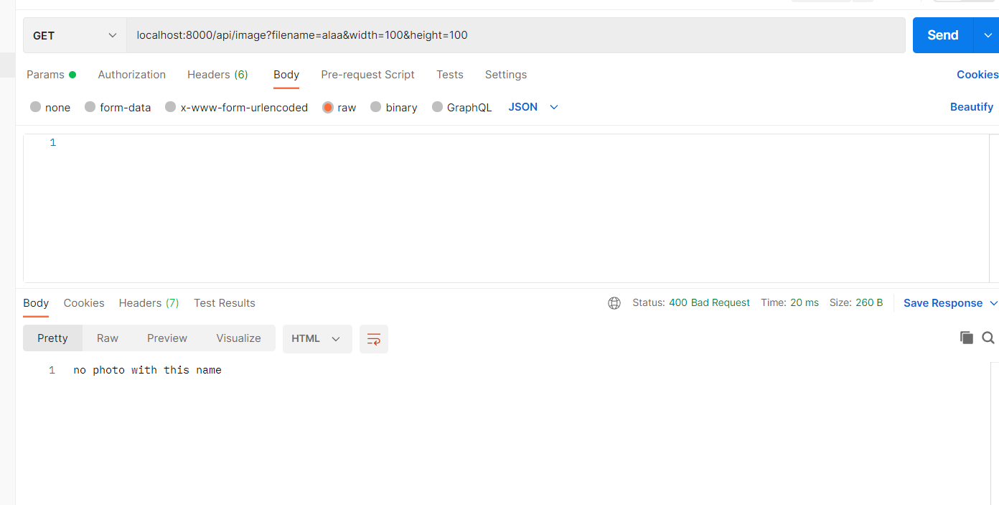
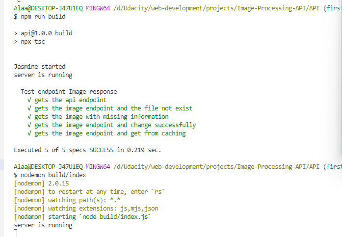

# Image-Processing-API
Udacity web development Nano degree, Image processing API
### All scripts will be found in the package.json
## Run The project
1. Go to API folder.
2. run npm install "to download all the node-modules in the package.json".
3. to run the API: npm run start.
4. Go to postman or the browser and write the url specifying the file name and the required width and height.
    - Example: localhost:8000/api/image?filename=encenadaport&width=100&height=100
5. the result image will be saved in thumbs folder with the new size, but at first it needs to exist in the src folder.
6. the image will be sent in the response.
## Compile the project
1. Go to API folder open Bash or the terminal.
2. To compile run: npm run build.
3. the compiled files will exist in the build folder.
4. you can run the compiled code by: nodemon build/index.js.
## Run prettier
1. Go to API folder, Bash or the terminal
2. To run prettier: npm run prettier.
## Run eslint
1. Go to API folder, Bash or the terminal. 
2. npm run lint.
## Run the unit tests
1. Go to API folder, Bash or the terminal.
2. To run the unit tests:
    - you can run npm run build then npm run jasmine.
    - or you can run npm test.

# Folders Structure
## Assets folder
assets folder containes:
    - The src folder which contains the source "original"images.
    - The thumbs folder which contains the resized images.
## build folder
- contains the compiled code.
## spec folder
- contains jasmine configuration for unit test.
## src folder contains the TypeScript code
1. ### index.ts which starts the server.
2. ### routes folder
    - contains the image route and call the controller to process the image.
3. ### controllers 
- The logic function which starts processing based on the criteria:
    - First if the required size already exists then return the cached image.
    - Check if the requested file exists in the src folder or not.
    - Save the processed image and return it.
4. ###  helpers
- In order to add single responsibility and write a clean code, there are two files:
    - Check existance.
    - Resize the Image
5. ### tests
- contains the unit tests for the API including:
    - Test the endpoint.
    - Test missing information.
    - Test unexisting files.
    - Test the cached images.
    - Test resize image.
## Samples
### Note, this process only the jpg format.
- successfully resized:

- missing information:

- file doesn't exist:

- run build & tests & run compiled:

